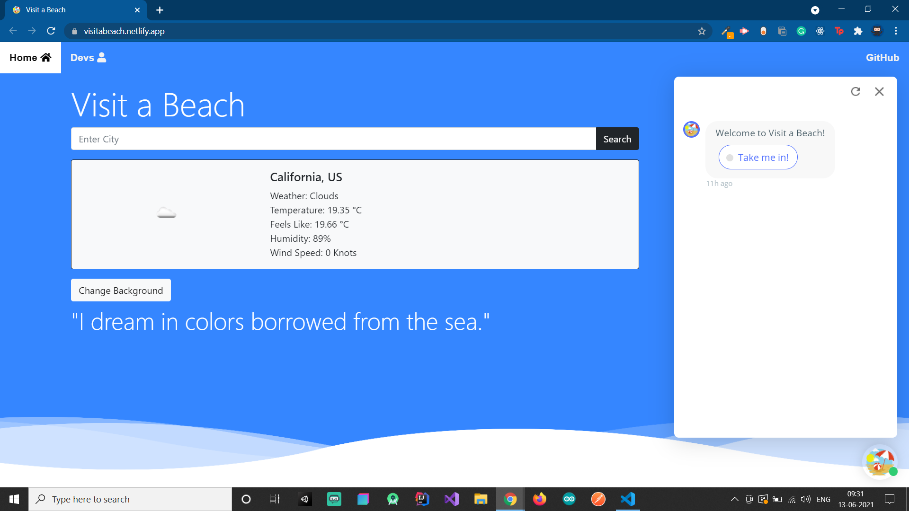
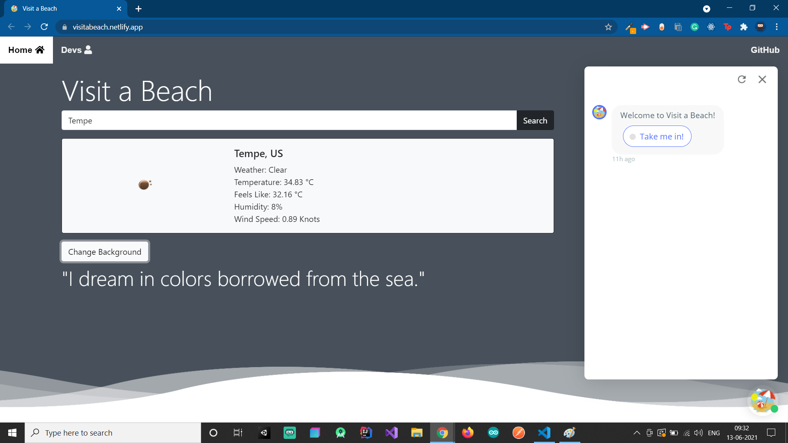
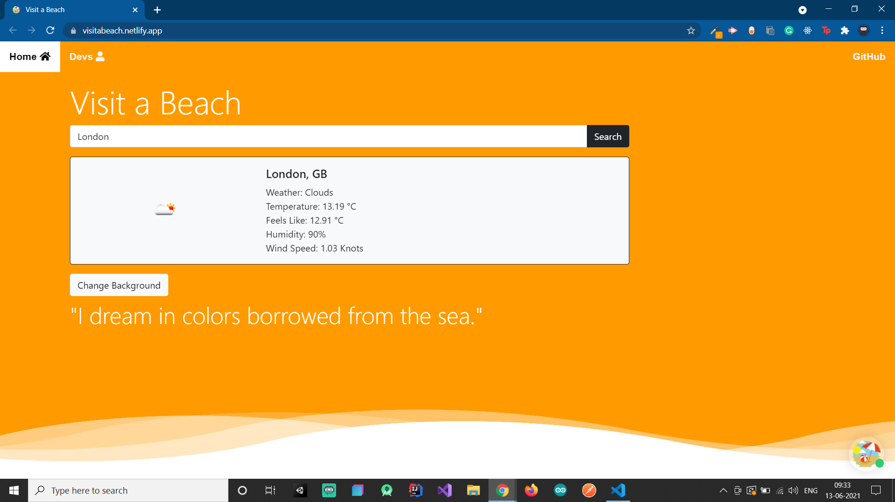
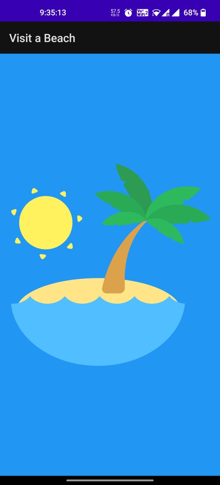
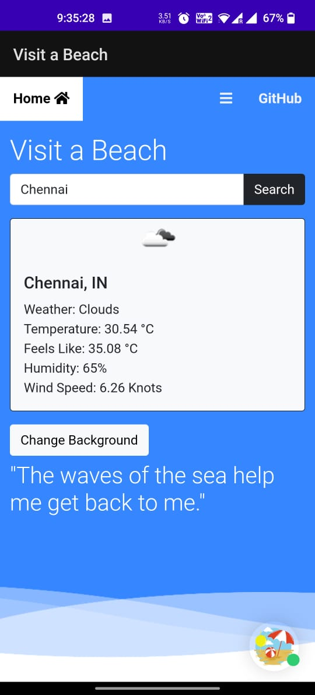
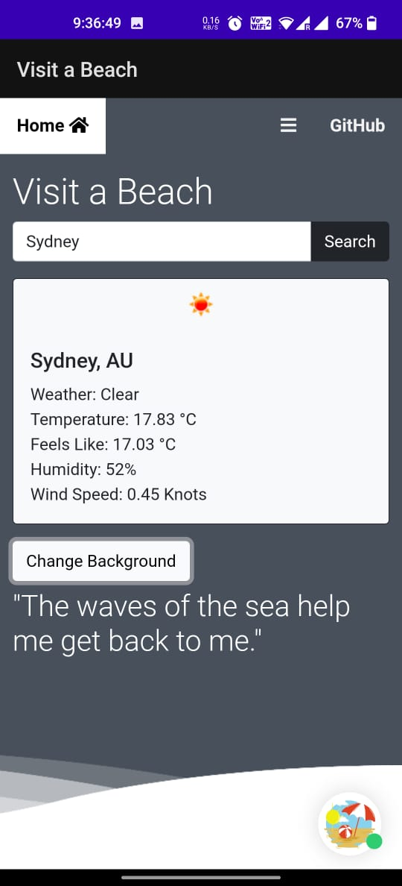

# Visit a Beach — Surfs Up Hacks

> **Before you head to the beach: check the weather, get a packing list, and grab a caption for your Insta. Built in 3 days at Surfs Up Hacks.**


  

---

## About

**Who:** Team **megaBite** — 4 students from SRM Institute of Science and Technology, Kattankulathur. Members included Gyanesh Samanta, Aaishika S. B., [pragya-bharti](https://www.github.com/pragya-bharti), and [yashsaini24](https://www.github.com/yashsaini24).
**What:** *Visit a Beach* — a beach-day companion that pulls live weather, recommends what to pack based on temperature and humidity, and serves Insta-ready captions.
**When:** Built in 3 days at **Surfs Up Hacks** (June 2021), an MLH-organized event.
**Where:** Web ([visitabeach.netlify.app](http://visitabeach.netlify.app)) + Android app (Java).
**Why:** People plan beach trips and forget the sunscreen. We made an app that tells you exactly what to bring before you leave.

## The Story

Meet Jack. Jack loves the beach. Jack always forgets sunscreen. Jack's mum hates that.

Visit a Beach fixes Jack — and any other beach-goer — by chaining three APIs into one experience:

1. **Live weather** via the OpenWeatherMap *Current Weather* API.
2. **Smart packing chatbot** built on **Collect.chat** that branches by temperature + humidity. *Hot and dry?* Sunscreen, hat, water. *Cool and breezy?* A windbreaker.
3. **Caption generator** with curated beach quotes for Insta posts.

We shipped two surfaces:

- **Web app** — vanilla JS + jQuery + Bootstrap, time-based background gradients
- **Android app** — Java app under `Android App/VisitaBeach/`

Three-day timeline:

- **Day 1:** docs, frontend scaffold, chatbot wiring, API key config
- **Day 2:** API integration, Android app, quotes section
- **Day 3:** responsiveness pass, polish, docs

We registered three domains for the submission: `visitabeach.online`, `beachwith.tech`, `beachwith.us`.

## Gallery

| | | |
|---|---|---|
|  |  |  |
|  |  |  |

---

## Tech Stack

- **Web:** HTML5, CSS3, JavaScript, jQuery, Bootstrap
- **Android:** Java (Android Studio project under `Android App/VisitaBeach/`)
- **APIs:** OpenWeatherMap (Current Weather)
- **Chatbot:** Collect.chat
- **Hosting:** Netlify

## Repo Structure

```
Surfs-Up-Hacks/
├── index.html              # Web app entry
├── devs.html               # Team credits page
├── assets/
│   ├── app.js / fetch.js / quotes.js / script.js / ui.js
│   ├── stylesheet/
│   ├── images/
│   └── repository/         # Banner + screenshots
├── Android App/
│   └── VisitaBeach/        # Android Studio project
└── README.md
```

## Getting Started

**Web:**

1. Open [visitabeach.netlify.app](http://visitabeach.netlify.app) in your browser, **or**
2. Clone and open `index.html`:

```bash
git clone https://github.com/GyaneshSamanta/Surfs-Up-Hacks.git
cd Surfs-Up-Hacks
# open index.html in your browser
```

(The page calls a public weather API at runtime — internet required.)

**Android:** open `Android App/VisitaBeach/` in Android Studio, sync Gradle, and run on an emulator or device. Pre-built APKs may be available under the *Releases* tab.

## Contributing

Hackathon code, but PRs welcome — particularly geocoding integration, more chatbot branches, and additional weather statistics.

## License

Released for educational and demo use.

## Credits

**Team megaBite** — built with care at Surfs Up Hacks 2021.

| Name | GitHub |
|---|---|
| Gyanesh Samanta | [@GyaneshSamanta](https://github.com/GyaneshSamanta) |
| Aaishika S. B. | [@aaishikasb](https://github.com/aaishikasb) |
| Pragya Bharti | [@pragya-bharti](https://www.github.com/pragya-bharti) |
| Yash Saini | [@yashsaini24](https://www.github.com/yashsaini24) |


